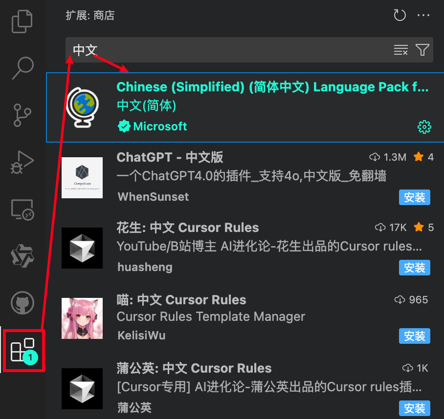
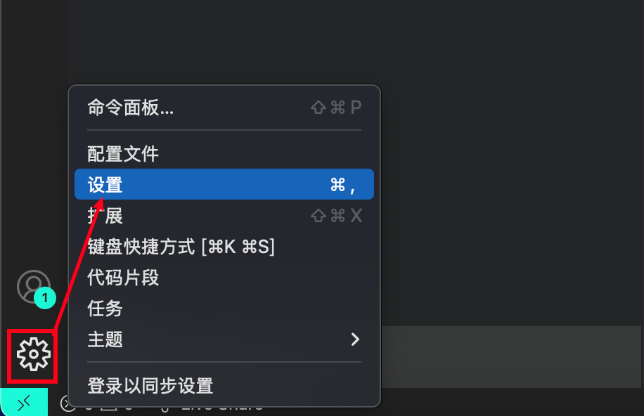
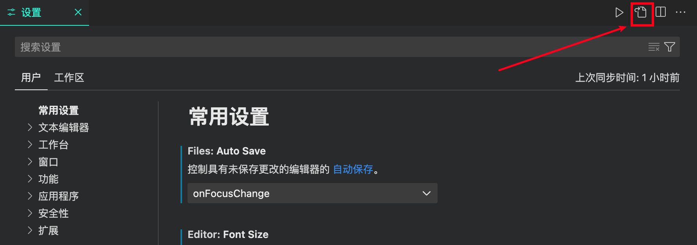
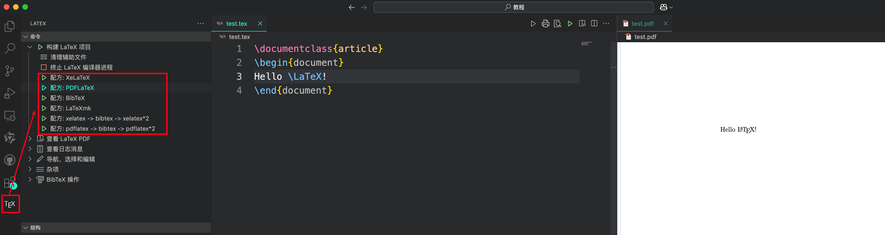
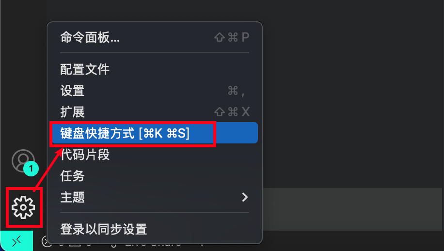
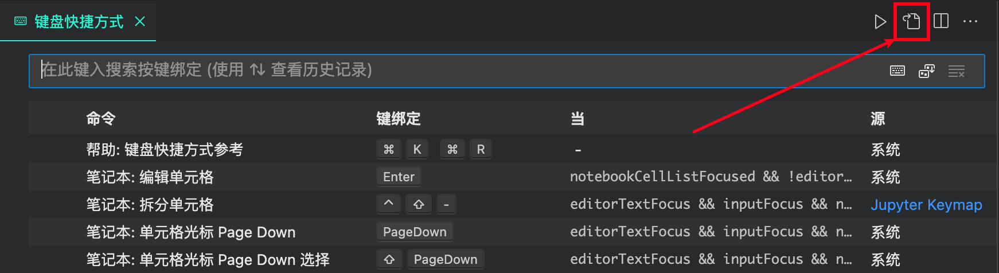
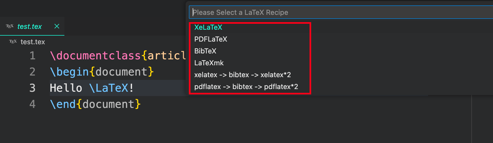
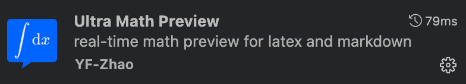
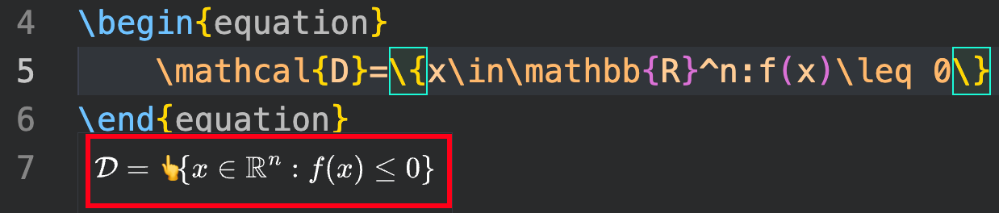

# 🔧 VS Code 配置 LaTeX｜macOS 版本
## ✅ 步骤 1：安装 LaTeX 引擎

- 下载 MaxTeX：[https://tug.org/mactex/mactex-download.html](https://tug.org/mactex/mactex-download.html)（文件大小约6个G）
- 下载完之后根据提示一步一步安装即可
- 验证是否安装成功：在 **终端** App输入 `pdflatex -v`，输出以下信息代表安装成功
```shell
>>> pdflatex -v
pdfTeX 3.141592653-2.6-1.40.27 (TeX Live 2025)
kpathsea version 6.4.1
Copyright 2025 Han The Thanh (pdfTeX) et al.
There is NO warranty.  Redistribution of this software is
covered by the terms of both the pdfTeX copyright and
the Lesser GNU General Public License.
For more information about these matters, see the file
named COPYING and the pdfTeX source.
Primary author of pdfTeX: Han The Thanh (pdfTeX) et al.
Compiled with libpng 1.6.46; using libpng 1.6.46
Compiled with zlib 1.3.1; using zlib 1.3.1
Compiled with xpdf version 4.04
```

## ✅ 步骤 2：安装 VS Code
- 官网下载 VS Code：[https://code.visualstudio.com/](https://code.visualstudio.com/)
- 根据提示安装

## 🔧 步骤 3：安装 VS Code 扩展

1. 安装中文扩展
   
2. 安装 `latex workshop`扩展
   

## ⚙️ 步骤 4：配置 LaTeX Workshop

1. 打开 VSCode 配置（或直接使用快捷键`Command+,`）：
    
2. 以 json 格式打开：
   
3. 在打开的 `settings.json` 中添加以下 latex 配置：

```json
{
    ...
    /* 上面是已有的配置，在下面添加新的配置项 */
    "latex-workshop.latex.autoBuild.run": "never",
    "latex-workshop.showContextMenu": true,
    "latex-workshop.intellisense.package.enabled": true,
    "latex-workshop.message.error.show": false,
    "latex-workshop.message.warning.show": false,
    "latex-workshop.latex.tools": [
        {
            "name": "xelatex",
            "command": "xelatex",
            "args": [
                "-synctex=1",
                "-interaction=nonstopmode",
                "-file-line-error",
                "%DOCFILE%"
            ]
        },
        {
            "name": "pdflatex",
            "command": "pdflatex",
            "args": [
                "-synctex=1",
                "-interaction=nonstopmode",
                "-file-line-error",
                "%DOCFILE%"
            ]
        },
        {
            "name": "latexmk",
            "command": "latexmk",
            "args": [
                "-synctex=1",
                "-interaction=nonstopmode",
                "-file-line-error",
                "-pdf",
                "-outdir=%OUTDIR%",
                "%DOCFILE%"
            ]
        },
        {
            "name": "bibtex",
            "command": "bibtex",
            "args": [
                "%DOCFILE%"
            ]
        }
    ],
    "latex-workshop.latex.recipes": [
        {
            "name": "XeLaTeX",
            "tools": [
                "xelatex"
            ]
        },
        {
            "name": "PDFLaTeX",
            "tools": [
                "pdflatex"
            ]
        },
        {
            "name": "BibTeX",
            "tools": [
                "bibtex"
            ]
        },
        {
            "name": "LaTeXmk",
            "tools": [
                "latexmk"
            ]
        },
        {
            "name": "xelatex -> bibtex -> xelatex*2",
            "tools": [
                "xelatex",
                "bibtex",
                "xelatex",
                "xelatex"
            ]
        },
        {
            "name": "pdflatex -> bibtex -> pdflatex*2",
            "tools": [
                "pdflatex",
                "bibtex",
                "pdflatex",
                "pdflatex"
            ]
        },
    ],
    "latex-workshop.latex.clean.fileTypes": [
        "*.aux", "*.bbl", "*.blg", "*.idx", "*.ind", "*.lof", "*.lot", "*.out", "*.toc", "*.acn", "*.acr", "*.alg", "*.glg", "*.glo", "*.gls", "*.ist", "*.fls", "*.log", "*.fdb_latexmk", "*.synctex.gz", "*.bcf", "*.run.xml", "*.nav", "*.snm", "*.vrb"
    ],
    "latex-workshop.latex.autoClean.run": "onBuilt",
    "latex-workshop.latex.recipe.default": "lastUsed",
    "latex-workshop.view.pdf.internal.synctex.keybinding": "double-click",
    "editor.unicodeHighlight.allowedLocales": {
        "zh-hans": true,
        "zh-hant": true
    },
    "[latex]": {
    
        "editor.defaultFormatter": "James-Yu.latex-workshop"
    }
}
```

## 🚀 步骤5：测试 LaTeX 环境

1. 新建文件 `test.tex`，输入以下内容：

```latex
\documentclass{article}
\begin{document}
Hello \LaTeX!
\end{document}
```

2. 保存文件，点击左侧 TeX 图标 → 选择编译的配方：
    -  `配方：XeLaTeX`：使用 `xelatex` 编译，针对有中文字符的文档。
    -  `配方：PDFLaTeX`：使用 `pdflatex` 编译，针对有中文字符的文档。
    -  `配方：BibTeX`：使用 `bibtex` 编译，用于生成文献引用。
    -  `配方：xelatex -> bibtex -> xelatex*2`：按顺序调用 `xelatex、bibtex、xelatex、xelatex` 编译，针对带有文献引用的中文文档。
    -  `配方：pdflatex -> bibtex -> pdflatex*2`：按顺序调用 `pdflatex、bibtex、pdflatex、pdflatex` 编译，针对带有文献引用的英文文档。
  
  对于测试文档，使用 `配方：PDFLaTeX` 编译，然后点击 `查看LaTeX PDF`，在右侧会出现 PDF 预览，到这一步就大功告成了🎉。
   

---

# ⚡ 进阶 Tips
## ⌨️ 配置快捷键编译
1. 打开键盘快捷方式：

2. 使用 json 格式打开：

3. 在打开的 `keybindings.json` 中添加以下内容：
```json
[
    {
        "key": "alt+r", // 快捷键1
        "command": "latex-workshop.recipes" //调用 latex-workshop 配方
    },
    {
        "key": "alt+s", // 快捷键2
        "command": "latex-workshop.recipes",
        "args": "pdflatex -> bibtex -> pdflatex*2", // 调用指定的 latex-workshop 配方
        "when": "editorTextFocus && editorLangId == latex"
    }
]
```
4. 此时使用 `快捷键1 (alt+r)` 会调出 latex-workshop 的所有配方，选择相应配方进行编译:

5. 使用 `快捷键2 (alt+s)` 会直接使用预设的配方进行编译。

## 🌟 公式实时预览插件：Ultra Math Preview
1. VS Code 扩展商店搜索 `Ultra Math Preview` 安装：
   
2. 在 `$...$` 或 `\begin{equation}...\end{equation}` 处悬停即可预览公式：  
   

🎉 恭喜你获得高效的 LaTeX 编写环境！
